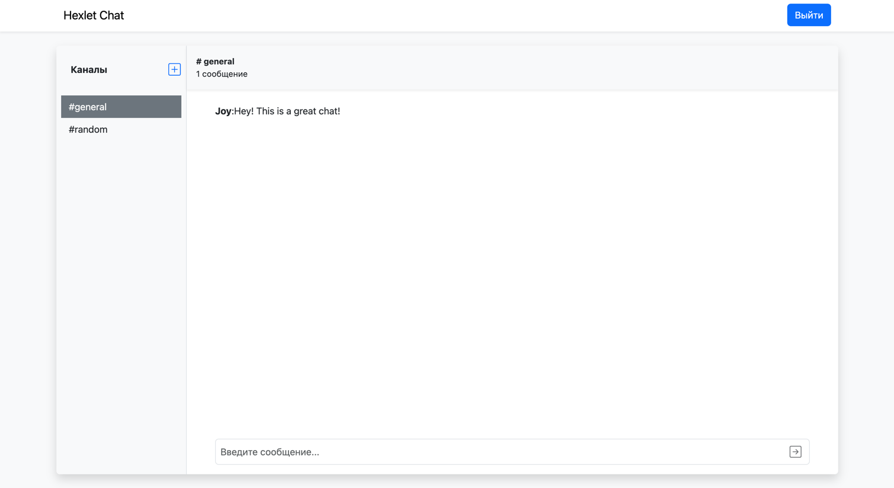

[](https://github.com/dregmar-bot/frontend-project-12/actions)
<a href="https://codeclimate.com/github/dregmar-bot/frontend-project-12/maintainability"></a>

# Chat app
## About
This package is a chat application using <a href=https://github.com/socketio/socket.io>socket.io</a> with the ability to add/remove channels


### Try to use:
https://frontend-project-12-web.onrender.com

## Setup
You need to clone gh repo for local use, then
```bash
npm ci
```

### Start
```bash
npm run start
```
### Build
```bash
npm run build
```

### Dependencies
- @reduxjs/toolkit: ^1.9.7,
- @rollbar/react: ^0.11.2,
- axios": ^1.6.1,
- bootstrap": ^5.3.2,
- formik: ^2.4.5, 
- i18next: ^23.6.0, 
- leo-profanity: ^1.7.0, 
- react: ^18.2.0, 
- react-bootstrap: ^2.9.1,
- react-dom: ^18.2.0,
- react-i18next: ^13.3.1,
- react-redux: ^8.1.3,
- react-router-dom: ^6.18.0,
- react-scripts: 5.0.1,
- react-toastify: ^9.1.3,
- rollbar: ^2.26.2,
- socket.io-client: ^4.7.2,
- web-vitals: ^2.1.4,
- yup: ^1.3.2

